# 3:4 图文卡片设计系统

> 基于 [frontend-slides](https://github.com/zarazhangrui/frontend-slides) 项目的 12 套视觉预设，改造为 3:4 比例（1080×1440）的图文卡片 HTML 模板。
> 
> 单文件、零外部依赖（字体除外），适合移动端阅读、社交媒体卡片、知识卡片、简报等场景。

---

## 特性

- **12 套视觉预设** — 暗色系 4 套、亮色系 4 套、特色主题 4 套
- **3:4 竖版画布** — 1080×1440 px，适配手机阅读
- **单 HTML 文件** — 所有 CSS/JS 内联，开箱即用
- **响应式缩放** — 自动适配任何屏幕尺寸
- **图文混排** — 支持图片插入，智能判断同页/分页放置
- **键盘/触屏翻页** — ← → 键或手指滑动
- **打印支持** — `@media print` 自动分页，导出 PDF

---

## 快速开始

```bash
# 克隆仓库
git clone https://github.com/你的用户名/3-4-card-presets.git

# 直接打开任意预设
open presets/paper-ink/index.html
```

或在浏览器中直接打开 `presets/<预设名称>/index.html`。

---

## 预设一览

### 🌑 暗色系

| 预设 | 预览 | 字体 | 强调色 | 氛围 |
|---|---|---|---|---|
| **Bold Signal** | 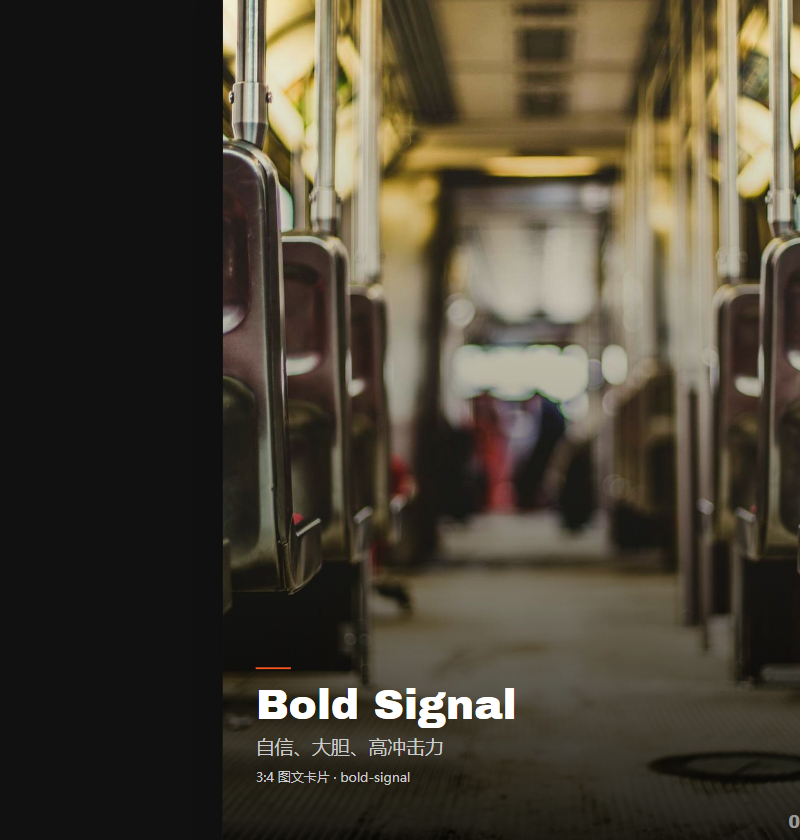 | Archivo Black / Space Grotesk | `#FF5722` 橙红 | 自信、大胆、高冲击 |
| **Electric Studio** | 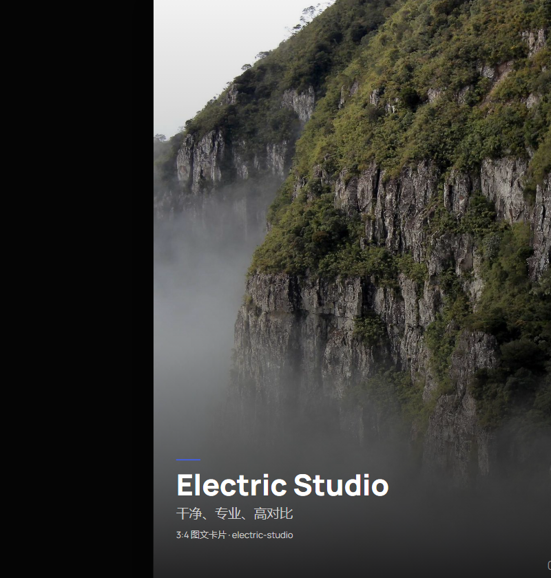 | Manrope (全家族) | `#4361ee` 电光蓝 | 干净、专业、高对比 |
| **Creative Voltage** | 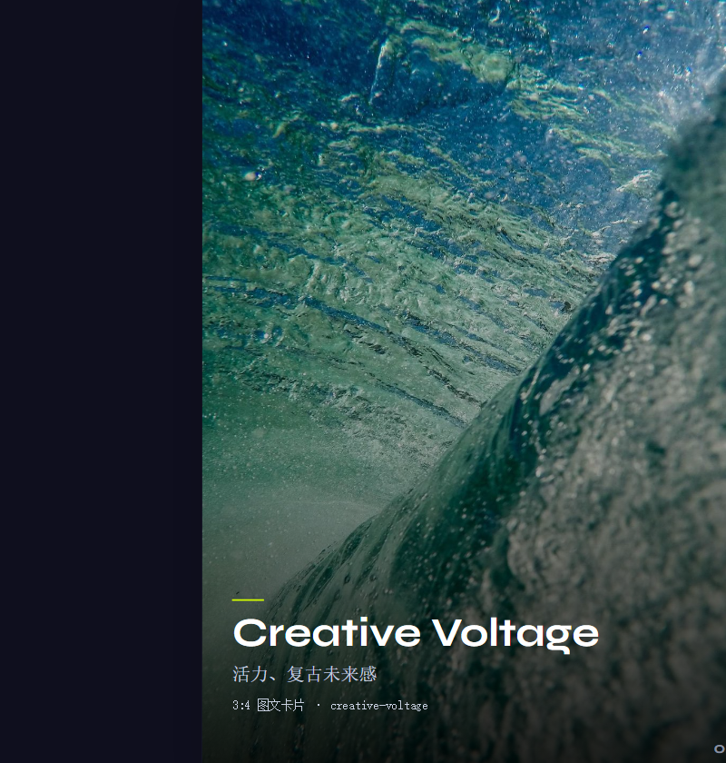 | Syne / Space Mono | `#d4ff00` 霓虹黄 | 活力、复古未来感 |
| **Dark Botanical** | 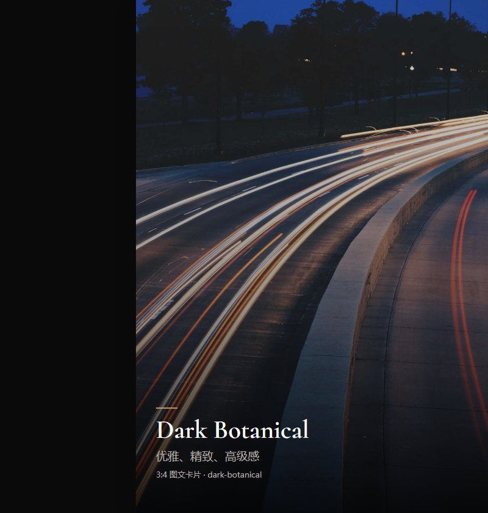 | Cormorant / IBM Plex Sans | `#d4a574` 暖棕 | 优雅、精致、高级感 |

### 🌓 亮色系

| 预设 | 预览 | 字体 | 强调色 | 氛围 |
|---|---|---|---|---|
| **Notebook Tabs** | 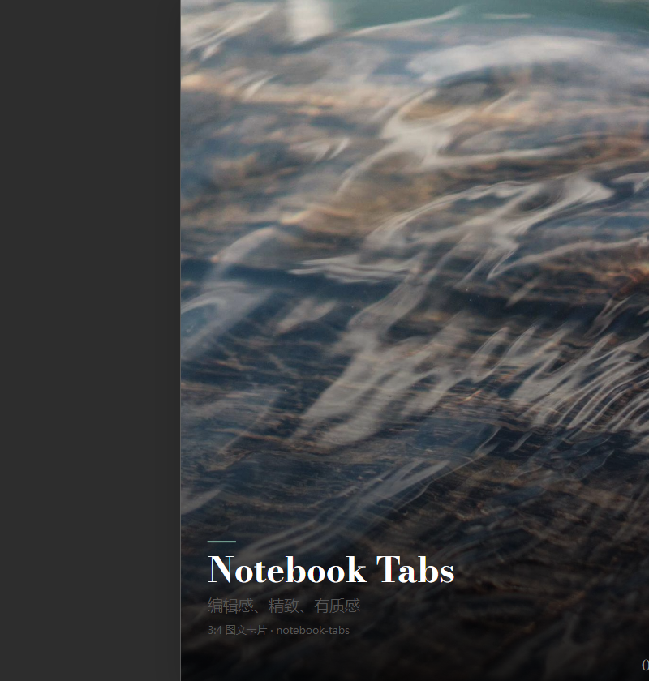 | Bodoni Moda / DM Sans | `#98d4bb` 薄荷 | 编辑感、精致、有质感 |
| **Pastel Geometry** | 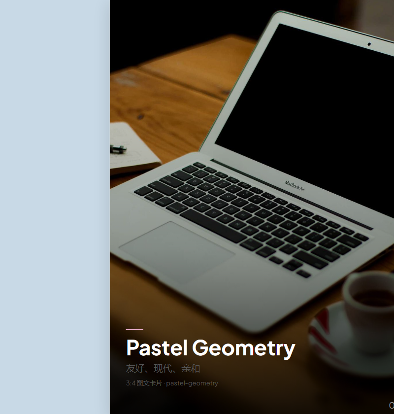 | Plus Jakarta Sans | `#f0b4d4` 粉红 | 友好、现代、亲和 |
| **Split Pastel** | 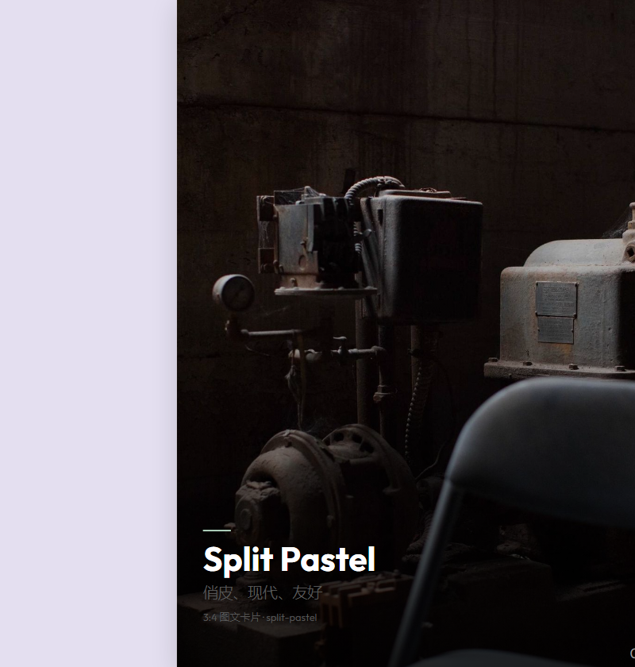 | Outfit (全家族) | `#c8f0d8` 薄荷 | 俏皮、现代、友好 |
| **Vintage Editorial** | 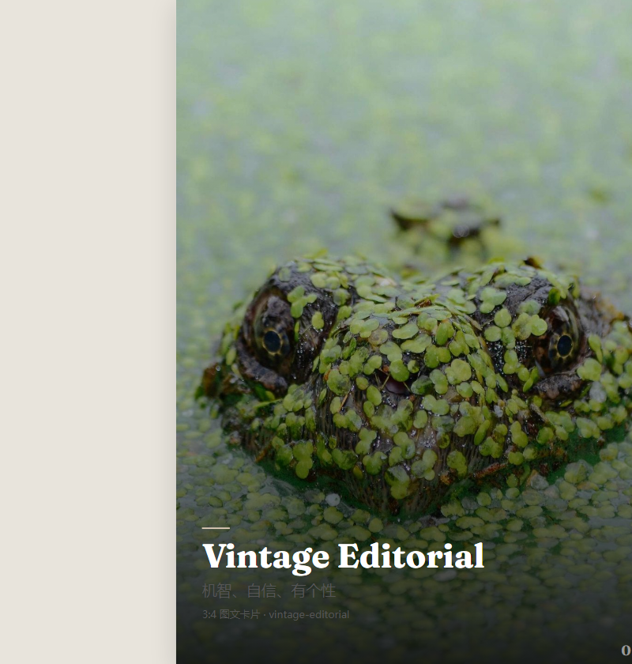 | Fraunces / Work Sans | `#e8d4c0` 暖灰 | 机智、自信、有个性 |

### ✨ 特色主题

| 预设 | 预览 | 字体 | 强调色 | 氛围 |
|---|---|---|---|---|
| **Neon Cyber** | 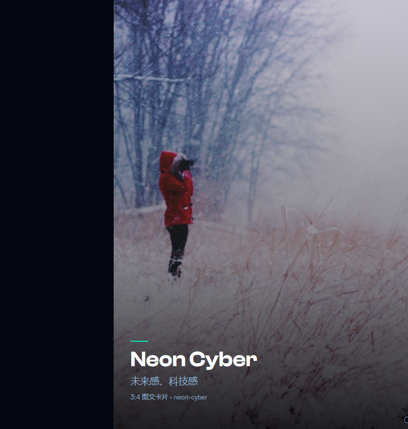 | Clash Display / Satoshi | `#00ffcc` 青霓虹 | 未来感、科技感 |
| **Terminal Green** | 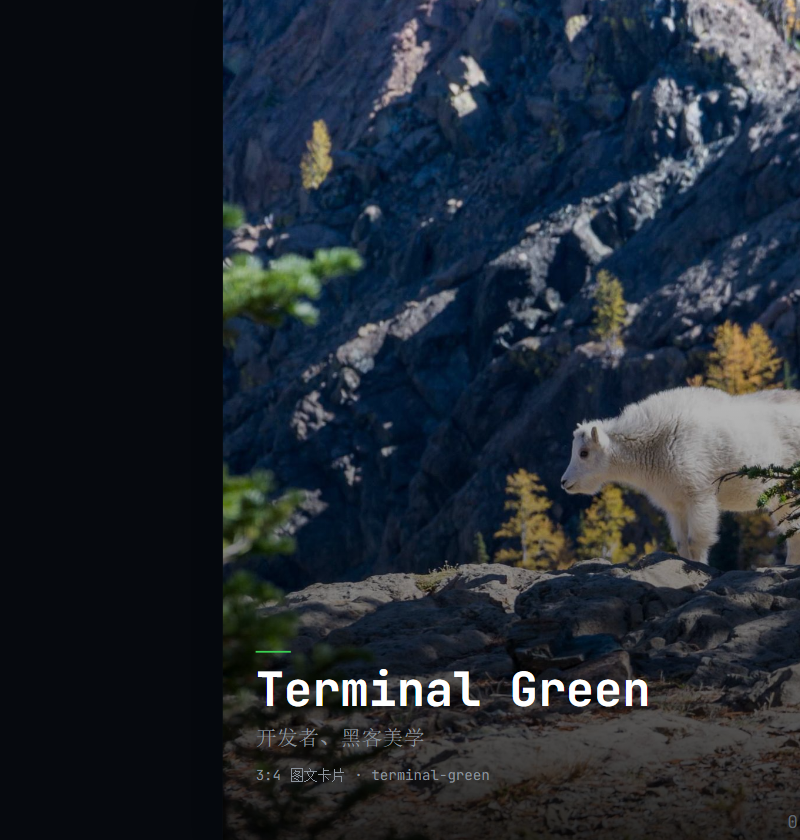 | JetBrains Mono (等宽) | `#39d353` 终端绿 | 开发者、黑客美学 |
| **Swiss Modern** | 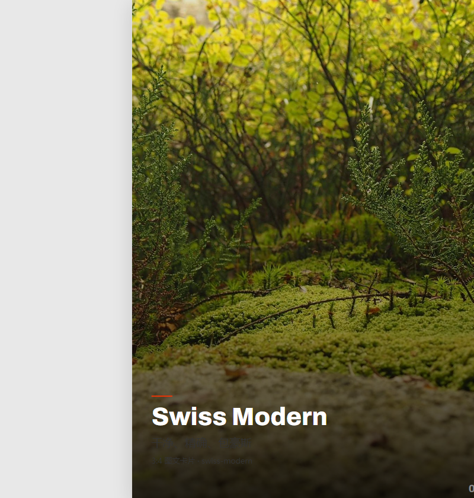 | Archivo / Nunito | `#ff3300` 红 | 干净、精确、包豪斯 |
| **Paper & Ink** | 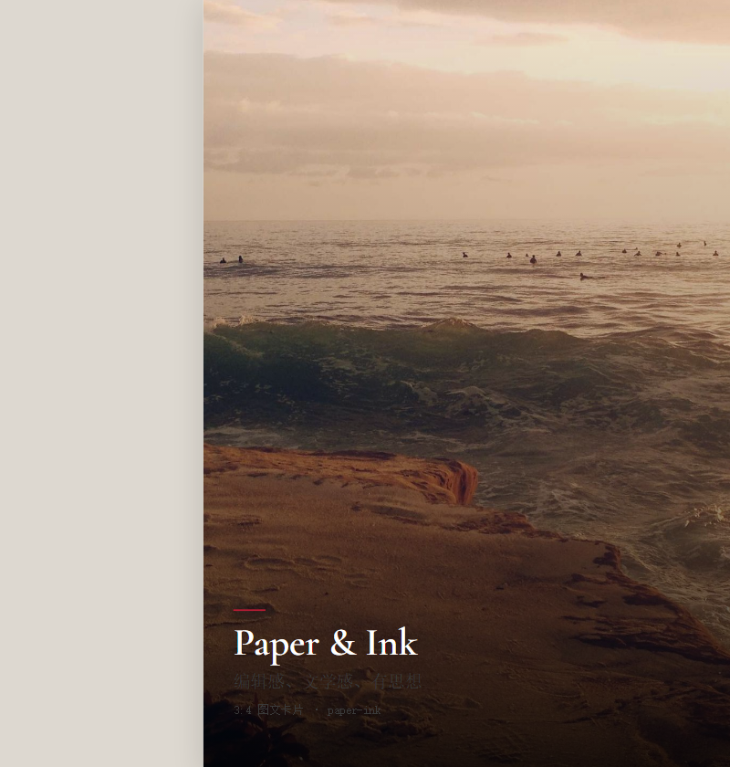 | Cormorant Garamond / Source Serif 4 | `#b81c34` 深红 | 编辑感、文学感 |

---

## 使用示例

项目中包含 3 个完整内容示例，展示如何将真实文章转化为卡片组：

| 示例 | 文件 | 卡片数 | 说明 |
|---|---|---|---|
| AI 与经济未来（核心版） | `examples/ai-economic-future.html` | 13 | 学术演讲提炼，Electric Studio 风格 |
| AI 与经济未来（叙事版） | `examples/ai-economic-future-narrative.html` | 16 | 完整叙事，Paper & Ink 风格 |
| 伊朗战事报道 | `examples/iran-war.html` | 12 | 新闻文章，Bold Signal 风格 |

---

## 目录结构

```
3-4-card-presets/
├── README.md
├── presets/
│   ├── bold-signal/
│   │   ├── index.html          # 预设 HTML 文件
│   │   └── 设计规范.md          # 预设设计规范
│   ├── electric-studio/
│   ├── creative-voltage/
│   ├── dark-botanical/
│   ├── notebook-tabs/
│   ├── pastel-geometry/
│   ├── split-pastel/
│   ├── vintage-editorial/
│   ├── neon-cyber/
│   ├── terminal-green/
│   ├── swiss-modern/
│   └── paper-ink/
├── examples/
│   ├── ai-economic-future.html
│   ├── ai-economic-future-narrative.html
│   └── iran-war.html
└── docs/
    ├── 设计规范.md              # 全局设计规范
    └── previews/               # 预设预览截图
```

---

## 设计规范要点

### 画布

| 属性 | 值 |
|---|---|
| 尺寸 | **1080 × 1440 px** (3:4) |
| 边距 | 52px（统一） |
| 正文 | 40px，行距 1.6 |
| 可用高度 | ≈ 1336px，约 20 行汉字 |

### 字体规则

所有**同时包含中文和数字/拉丁字符**的元素必须使用正文字体 `--fb`（Source Serif 4 等），避免显示字体 `--fd`（Cormorant Garamond 等）的拉丁数字与 fallback 中文字号不匹配。

> 详情见 [`docs/设计规范.md`](docs/设计规范.md)

---

## 如何创作自己的卡片

1. 选择一个预设，复制 `presets/<名称>/index.html`
2. 替换 4 张示例卡片的内容为你的文章段落
3. 调整卡片数量（复制 `<section class="s">` 整块）
4. 替换封面图片的 `src` 为你的图片 URL
5. 图片智能放置：文字后空间足够则同页，否则下一页以图开头

---

## 技术依赖

- **Google Fonts** — 各预设使用的字体（首次加载需联网）
- 无其他外部依赖。所有样式和脚本内联在单个 HTML 文件中。

---

## License

MIT
